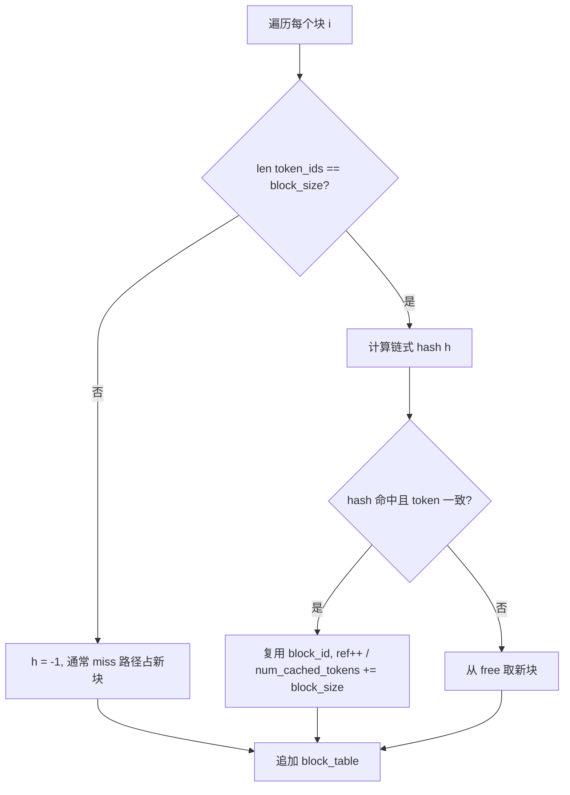

# 课程10：PagedAttention 与 BlockManager

> 像操作系统把物理页框分配给虚拟页一样，把 **KV Cache 池** 切成固定块，用 **块表** 描述每条序列的逻辑地址映射，并用 **哈希前缀复用** 共享 prompt，从而在多请求并发下既省显存又提高命中率。

## 本课目标

- 用 **虚拟内存分页类比** 理解 PagedAttention 解决什么问题（碎片、共享、按需分配）。
- 掌握 **`Block`**、**`block_table`**、**`free_block_ids` / `used_block_ids`** 的职责。
- 理解 **`xxhash` + prefix** 如何为「整块 token」生成可复用指纹。
- 能口述 **`allocate`** 在 cache hit / miss 下的分支，以及 **`may_append`** 何时扩块、何时给块打哈希。
- 解释 **`ref_count`** 与 **deallocate** 的引用计数语义及面试延伸。

## 核心概念

### 1. 为何在「大块连续 KV 张量」之上还要 PagedAttention

上一课 `allocate_kv_cache` 分配了 **物理池**（按块数 × 块大小 × 层 × …）。若每个序列占用 **连续固定长度** 的区间，会遇到：

- **内部碎片**：序列长度不是块倍数时尾部浪费；
- **外部碎片/调度难**：多序列动态增删时难以紧凑复用；
- **前缀共享困难**：相同 system prompt 的多请求若各拷贝一份 KV，浪费显存。

PagedAttention 思路：**逻辑上** 用块表记录「第 i 块 token 落在哪个物理 `block_id`」，物理块可来自池中任意空闲槽；必要时多个序列 **共享** 同一物理块（只读共享 + 引用计数）。

### 2. Block：物理槽位的元数据

每个 `Block` 有：

- **`block_id`**：在池中的索引；
- **`ref_count`**：被多少条序列/逻辑引用（为 0 时可回收到 `free_block_ids`）；
- **`hash`**：整块填满后对 `(token_ids, prefix_hash)` 计算出的摘要，`-1` 表示未封包或未满块；
- **`token_ids`**：该块当前承载的 token 列表（用于校验哈希表冲突或错误命中）。

### 3. `hash_to_block_id`：全局哈希表

从 **内容哈希** 映射到 **物理块 id**，实现「若见过同一段 token 序列且块内容一致，则复用物理块」。

### 4. xxhash 与 `prefix` 参数

```python
@classmethod
def compute_hash(cls, token_ids, prefix=-1):
    h = xxhash.xxh64()
    if prefix != -1:
        h.update(prefix.to_bytes(8, "little"))
    h.update(np.array(token_ids).tobytes())
    return h.intdigest()
```

- **`prefix`**：通常为 **前一块的哈希**（链式）。这样整块内容不仅依赖本块 token，还依赖上文，降低「不同上下文碰巧 token 相同」的碰撞风险（与仅哈希 本块 裸 token 相比更稳）。
- **为何用 xxhash**：极快、非密码学哈希即可；适合运行时键。

### 5. `allocate`：为整条序列初次占位

用户提供的源码逻辑（与 `nanovllm/engine/block_manager.py` 一致）要点：

- 对序列的 **每一个块索引** `i`，取出 `seq.block(i)` 的 `token_ids`。
- **仅当** `len(token_ids) == block_size` 时，才计算链式哈希 `h`；否则 `h = -1`（未满块不参与全局复用索引）。
- 查 `hash_to_block_id.get(h)`；若不存在或块内 `token_ids` 不一致 → **cache miss**，从 `free_block_ids` 取新物理块。
- **cache hit** 时：可增加 `num_cached_tokens`（命中整块的 token 数），并可能 **增加引用计数**（共享块）。
- 最后把选中的 `block_id` 追加到 `seq.block_table`。

### 6. `deallocate`：逆序释放引用

从 `block_table` **反向**遍历，每步 `ref_count -= 1`，为 0 则 `_deallocate_block` 归还空闲队列。逆序与分配顺序对称，便于调试与某些一致性约束。

### 7. `can_append` 与 `may_append`：解码增长

```python
def can_append(self, seq):
    return len(self.free_block_ids) >= (len(seq) % self.block_size == 1)
```

在 Python 中，`(len(seq) % self.block_size == 1)` 为布尔值；与整数比较时 `True` 视为 `1`，`False` 视为 `0`。

- 当 **长度对块大小取模为 1** 时，下一步 `may_append` 将 **需要新物理块**（见下文 `may_append` 分支），因此要求 `free_block_ids` 至少 **1 个**。
- 否则不需要为新块预留，`>= 0` 恒成立（在空闲块数非负时）。

**`may_append`**（序列已有一块「当前尾块」）：

- **`len(seq) % block_size == 1`**：刚进入新块边界状态，**断言**上一块已有有效 `hash`，从空闲队列 **再分配一个新 `block_id`** 追加到 `block_table`（新块先占位，后续 token 写入）。
- **`len(seq) % block_size == 0`**：刚好填满一块，取 **本块** `token_ids`，用 **前一块** 的 `hash` 作为 `prefix` 计算 `h`，`last_block.update(h, token_ids)` 并登记 `hash_to_block_id`。
- **其他情况**：尾块未满，`assert last_block.hash == -1`（未满块不打全局复用哈希）。

（具体与 `Sequence.block` 的索引约定结合阅读。）

### 8. 与操作系统分页的类比

| OS 概念 | PagedAttention |
|--------|----------------|
| 物理页框 | `Block(block_id)` 槽位 |
| 虚拟页表 | `seq.block_table` |
| 页共享（共享库） | 相同前缀 token 块哈希命中，多序列 `ref_count++` |
| 缺页分配 | cache miss → `_allocate_block` |

---

## 源码解析

### `Block.reset` 与 `_allocate_block`

源码中 `_allocate_block` 会 `block.reset()`：`ref_count = 1`，清空 `hash` 与 `token_ids`，并从 `free_block_ids` 移除、加入 `used_block_ids`。

### `can_allocate`

（完整源码中还有 `can_allocate`：检查空闲块是否 **不少于序列所需块数** `seq.num_blocks`，用于调度器在接纳新请求前判断是否装得下。）

### 引用计数何时 +1

- **allocate 命中**且该块 **已在 used 集合**：说明多序列共享，`ref_count += 1`。
- **新分配**：`reset` 将 `ref_count` 置为 1。

---

## 图解

### allocate：cache hit vs miss（简化）



### may_append：三种模情况（概念）

```text
len % B == 1  -->  需要新物理块，block_table 增长
len % B == 0  -->  满块，写入 hash 与 hash_to_block_id
else           -->  未满块，不登记全局 hash
```

---

## 面试考点

### PagedAttention 论文与 vLLM

面试可简述：**块级 KV、块表、按需分配、前缀共享**；nano-vllm 为教学/精简实现，细节与生产 vLLM 可能有差异，但思想一致。

### 哈希碰撞怎么办

非密码学哈希存在碰撞概率；实现用 **块内 token 列表二次校验**（`token_ids !=` 则视为 miss），`hash_to_block_id` 仅作加速索引。

### 为何不满块 `h = -1`

未满块内容仍随生成变化，**不能**作为稳定全局键；等填满再登记。

### 并发与线程安全

单进程推理调度若单线程执行 BlockManager，通常无锁；多线程需额外同步（超出本仓库讨论）。

---

## 常见面试题

1. **PagedAttention 与连续 KV Cache 区别？**  
   连续：简单但碎片与共享差；分页：块表映射，易共享与复用。

2. **`ref_count` 为 0 表示什么？**  
   无序列再引用该物理块，可回收到空闲链表。

3. **prefix 用前块 hash 的目的？**  
   链式指纹，减少「不同上下文同一段落」的假命中。

4. **`can_append` 为何与 `len % block_size == 1` 绑定？**  
   该条件下下一次增长将 **跨越到新物理块**，需确保仍有空闲块。

5. **BlockManager 与 ModelRunner.kv_cache 关系？**  
   ModelRunner 分配 **张量内存**；BlockManager 分配 **逻辑块 id** 与映射，Attention kernel 按 `block_table` 把 token 写入正确物理槽。

6. **最坏情况显存？**  
   无共享、每序列独占块表，趋近于连续分配；共享越好越省。

---

## 小结

PagedAttention 将 KV 存储块化，并用 `block_table` 描述序列到物理块的映射；`xxhash` 链式哈希支持前缀块复用；`allocate` 处理首次建表与命中/miss，`may_append` 在生成过程中扩块与封包哈希，`ref_count` 管理共享生命周期。与 OS 分页类比有助于快速建立心智模型。

## 下一课预告

若你按目录顺序学习，可继续 **调度器 / 连续批处理** 等章节，把「块级 KV」与「批内多序列调度」连成完整推理系统。

---

### 附录：与 `Sequence` 的协同（阅读提示）

实际工程中，`seq.num_blocks`、`seq.block(i)`、`len(seq)` 均在 **`Sequence`** 类中定义：前者由当前 token 数与 `block_size` 推导，后者返回第 i 个逻辑块内的 token 切片。阅读 `nanovllm/engine/sequence.py` 可把本课的「块索引」与「用户可见的 prompt+生成串」对应起来，避免只记 BlockManager 而脱节。

### 附录：调试清单（自测）

1. 同一 prompt 的两个请求是否可能共享前若干 `block_id`？（期望：命中时 `ref_count>1` 或复用同一 id。）
2. 生成到新块边界时，`can_append` 是否在空闲块不足时返回假？（调度器应等待或抢占。）
3. `deallocate` 后 `block_table` 是否清空、`num_cached_tokens` 是否归零？

以上问题能答出，说明已把 **内存池 + 逻辑映射 + 生命周期** 串成闭环。

